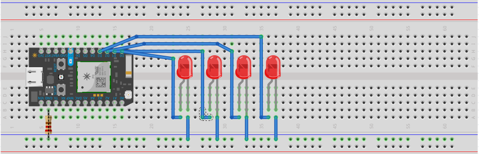

El primer examen consiste en cinco etapas.

1. Encender LED2 y LED4 por medio segundo y apagarlos durante medio segundo.
2. PWM LED1 y LED3 de 0 a 100% y de 100 a 0%
3. Encender y apagar los LED uno a uno de izquierda a derecha y luego de regreso sin repetir.
4. PWM a los cuatro LEDs de 0 a 100% y luego de 100% a 0%
5. Encender cada LED de derecha a izquierda a una cadencia de 250ms entre cada LED y luego apagarlos en el sentido contrario con la misma demora.

 <!-- more -->

## Materiales

- 4 LED.
- 1 Particle Photon.
- 1 Resistencia 220 Ohms.
- 8 Cables dupont.

## Configuración física



## Código

### Declaración

```cpp
int tiempoEntreLEDs = 500; // tiempo entre LEDs
int tiempoPWM = 5; // tiempo entre actualizaciones PWM
```

### Inicialización

```cpp
// Las instrucciones dentro del bloque setup sólo se ejecutan una vez
void setup()
{
    for (int i = 0; i <= 3; i++) // Inicializando D0 a D3.
    {
        pinMode(i, OUTPUT);
    }
}
```

### Ciclo

```cpp
// Las instrucciones dentro de la función loop se repiten indefinidamente.
void loop()
{
    // Encender LED2 y LED4 por medio segundo y apagar por medio segundo #1
    digitalWrite(1,HIGH);
    digitalWrite(3,HIGH);
    delay(500);
    digitalWrite(1,LOW);
    digitalWrite(3,LOW);
    delay(500);
    // PWM LED1 y LED3 de 0-100%  y de regreso #2
    for(int i=0; i<255; i++){ // yendo de 0% a 100%
        analogWrite(0,i);
        analogWrite(2,i);
        delay(tiempoPWM);
    }
    for(int i=255; i>=0; i--){ // yendo de 100% a 0%
        analogWrite(0,i);
        analogWrite(2,i);
        delay(tiempoPWM);   
    }
    // Secuencia de LEDs de izquierda a derecha y viceversa #3
    for (int i = 0; i <= 2; i++) // encendiendo y apagando hacia la derecha
    {
        digitalWrite(i, HIGH);
        delay(tiempoEntreLEDs);
        digitalWrite(i, LOW);
        delay(tiempoEntreLEDs);
    }
    for (int i = 3; i >= 0; i--) // encendiendo y apagando hacia la izquierda
    {
        digitalWrite(i, HIGH);
        delay(tiempoEntreLEDs);
        digitalWrite(i, LOW);
        delay(tiempoEntreLEDs);
    }
    // Los cuatro LEDs en PWM de 0-100% y de 100-0% #4
    for(int i=0; i<=255; i++){ // PWM de 0% a 100%
        analogWrite(0,i);
        analogWrite(1,i);
        analogWrite(2,i);
        analogWrite(3,i);
        delay(tiempoPWM);
    }
    for(int i=255; i>=0; i--){ // PWM de 100% a 0%
        analogWrite(0,i);
        analogWrite(1,i);
        analogWrite(2,i);
        analogWrite(3,i);
        delay(tiempoPWM);
    }
    // Encendiendo de derecha a izquierda y apagando en orden inverso a ritmo de 1/4 de segundo #5
    for (int i = 3; i >= 0; i--) // encendiendo cada LED 250ms después del anterior
    {
        digitalWrite(i, HIGH);
        delay(tiempoEntreLEDs);
    }
    for (int i = 0; i <= 3; i++) // apagando cada LED 250ms después del anterior
    {
        digitalWrite(i, LOW);
        delay(tiempoEntreLEDs);
    }
}
```


[Código de ejemplo aquí.](https://github.com/xtrs84zk/SistemasEmbebidos/blob/main/src/Examen1.ino)