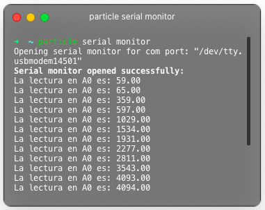

La decimoprimer práctica consiste en medir el valor analógico en A0 a través de un potenciómetro. El valor obtenido se imprime al puerto serial que será leído desde la computadora utilizando el comando **particle serial monitor**.

 <!-- more -->

## Materiales

- 1 Particle Photon.
- 1 Cable USB para datos.
- 1 Potenciómetro, se utilizó el B20K.
- 3 Cables dupont.

## Configuración física

Previamente, se debe conectar el mismo cable usb tanto al dispositivo Particle Photon, como a la computadora que se esté utilizando. En caso de no contar con el particle-cli ya instalado, se puede obtener a través de node con la instrucción **npm i -g particle-cli** ; para Windows y demás, favor de revisar [la documentación](https://docs.particle.io/tutorials/developer-tools/cli/).


<table>
<tr>
<th></th>
<th>Se conecta el cable desde la entrada analógica A0 al potenciómetro y se mide la respuesta en el puerto serial.</th>
</tr>
</table>

## Código

### Declaración

```cpp
double lectura = 0; // se declara e inicializa la variable para almacenar la lectura
```

### Inicialización

```cpp
void setup()
{
    pinMode(A0, INPUT); // se declara la entrada analógica A0 como entrada
    Serial.begin(9600); // se inicializa el puerto serial para el monitoreo
}
```

### Ciclo

```cpp
void loop()
{
    lectura = analogRead(A0); // se lee la entrada analógica A0 que proporciona valores de 0-4095
    Serial.print("La lectura en A0 es: ");
    Serial.println(lectura); // se imprime el valor en lectura
    delay(1000);             // esperando 1 segundo entre cada instalación
}
```

[Código de ejemplo aquí.](https://github.com/xtrs84zk/SistemasEmbebidos/blob/main/src/Practica10.ino)
