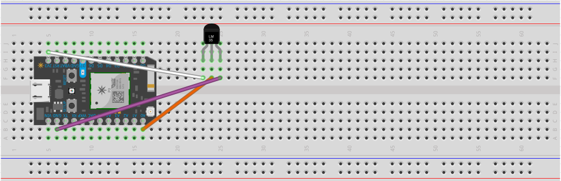
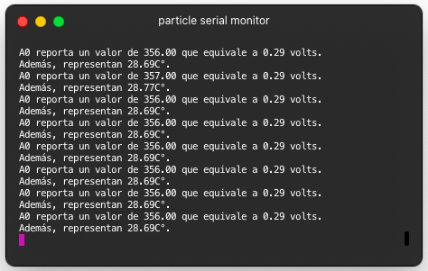

La decimotercer práctica consiste en medir el valor analógico en A0 a través de un sensor de temperatura. El valor obtenido se imprime al puerto serial luego de ser convertido a voltaje, será leído desde la computadora utilizando el comando **particle serial monitor**.

 <!-- more -->

## Materiales

- 1 Particle Photon.
- 1 Cable USB para datos.
- 1 Sensor de temperatura LM35.
- 3 Cables dupont.

## Configuración física

Previamente, se debe conectar el mismo cable usb tanto al dispositivo Particle Photon, como a la computadora que se esté utilizando. En caso de no contar con el particle-cli ya instalado, se puede obtener a través de node con la instrucción **npm i -g particle-cli** ; para Windows y demás, favor de revisar [la documentación](https://docs.particle.io/tutorials/developer-tools/cli/).



<table>
<tr>
<th></th>
<th>Se conecta el cable desde la entrada analógica A0 al sensor LM35 y se mide la respuesta en el puerto serial.</th>
</tr>
</table>


## Código

### Declaración

```cpp
double lectura = 0;
// se declara e inicializa la variable para almacenar la lectura
double voltaje = 0;
// se declara e inicializa una variable para almacenar la conversión a voltaje
double temperatura = 0;
// se declara e inicializa una variable para almacenar la conversión a temperatura en C°
```

### Inicialización

```cpp
void setup()
{
    pinMode(A0, INPUT);
  // se declara la entrada analógica A0 como entrada
    Serial.begin(9600);
  // se inicializa el puerto serial para el monitoreo
}
```

### Ciclo

```cpp
void loop()
{
    lectura = analogRead(A0);
  // se lee la entrada analógica A0 que proporciona valores de 0-4095
    voltaje = lectura / 4095 * 3.3;
  // se convierte el valor con base en la traducción a voltaje
    temperatura = voltaje * 100;
  // se convierte el voltaje a temperatura en grados celsius
    Serial.print("A0 reporta un valor de ");
  // concatenando en el puerto serial el string
    Serial.print(lectura);
  // se imprime el valor en lectura analógica
    Serial.print(" que equivale a ");
  // concatenando en el puerto serial el string
    Serial.print(voltaje);
  // se imprime el valor en voltaje
    Serial.println(" volts. Además, representan ");
  // concatenando en el puerto serial el string
    Serial.print(temperatura);
  // se imprime el valor en temperatura
    Serial.println("C°.");
  // concatenando en el puerto serial el string
    delay(1000);
  // esperando un segundo antes de la siguiente iteración
}
```

[Código de ejemplo aquí.](https://github.com/xtrs84zk/SistemasEmbebidos/blob/main/src/Practica13.ino)
