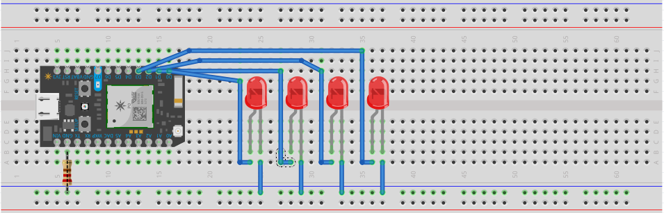

La sexta práctica consiste en encender cuatro LEDs a diferentes intensidades <u>perceptibles</u> haciendo uso de la tecnología PWM. El primer LED debe encender al 100% de su intensidad, el segundo al 50%, el tercero al 20% y el cuarto al 5%. <!-- more -->

## Materiales

- 4 LED.
- 1 Particle Photon.
- 1 Resistencia 220 Ohms.
- 8 Cables dupont.

## Configuración física



## Código

### Declaración

```cpp
int tiempo = 500; // medio segundo
```

### Inicialización

```cpp
void setup()
{
    for (int i = 0; i <= 3; i++)
    {
        pinMode(i, OUTPUT);
    }
}
```

### Ciclo

```cpp
void loop()
{
    // 100%
    analogWrite(0, 255);
    // 50%
    analogWrite(1, 125.5);
    // 20%
    analogWrite(2, 51);
    // 5%
    analogWrite(3, 12.75);
}
```


[Código de ejemplo aquí.](https://github.com/xtrs84zk/SistemasEmbebidos/blob/main/src/Practica6.ino)
