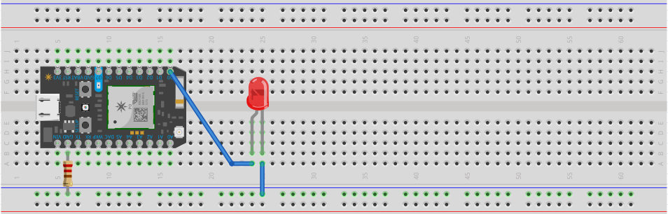

La séptima práctica consiste en incrementar lentamente la intensidad de un LED haciendo uso de PWM. <!-- more -->

## Materiales

- 1 LED.
- 1 Particle Photon.
- 1 Resistencia 220 Ohms.
- 4 Cables dupont.

## Configuración física



## Código

### Declaración

```cpp
int tiempo = 50;
```

### Inicialización

```cpp
void setup()
{
    pinMode(0, OUTPUT);
}
```

### Ciclo

```cpp
void loop()
{
    // Incrementando la intensidad del LED paulatinamente cada $tiempo.
    for (int i = 0; i <= 255; i++)
    {
        analogWrite(0, i);
        delay(tiempo);
    }
}
```


[Código de ejemplo aquí.](https://github.com/xtrs84zk/SistemasEmbebidos/blob/main/src/Practica7.ino)